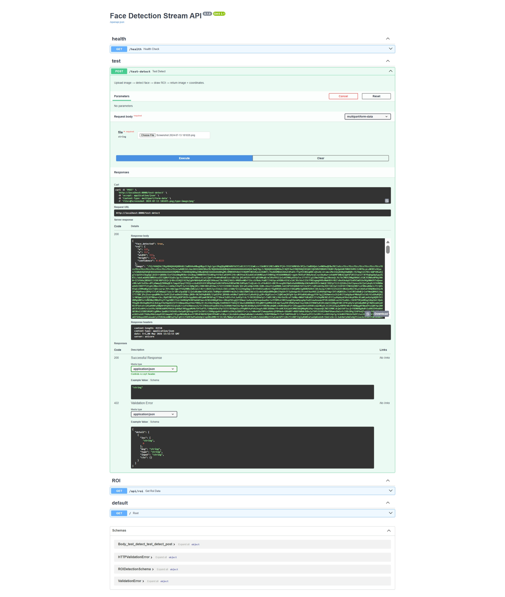

# Real-Time Face Detection Video Streaming System

## Overview

This project is a containerized real-time face detection video streaming system built using FastAPI, WebSockets, PostgreSQL, Docker, and a lightweight frontend using HTML/CSS/JavaScript.

The system captures live webcam video from the browser, streams frames to the backend through WebSockets, performs face detection, draws a bounding box around the detected face without using OpenCV, stores ROI (Region of Interest) data into PostgreSQL, and streams processed frames back to the frontend in real time.

---

# Features

- Real-time webcam video streaming
- Face detection on each frame
- ROI bounding box drawing without OpenCV
- WebSocket-based bidirectional communication
- PostgreSQL database integration
- Async FastAPI backend
- Dockerized backend + database
- ROI data persistence
- REST API endpoints for ROI retrieval
- Lightweight frontend dashboard
- Start / Stop camera controls

---

# Tech Stack

### Backend
- Python
- FastAPI
- WebSockets
- SQLAlchemy (Async)
- PostgreSQL
- Pillow (PIL)
- MediaPipe / Face Detection Model
- Docker

### Frontend
- HTML
- CSS
- JavaScript

### DevOps
- Docker Compose

---

# System Architecture

 created By AI


---

# Architecture Flow

1. Browser accesses webcam
2. Frames are captured using JavaScript
3. Frames are converted into Base64 JPEG format
4. Frames are sent to FastAPI backend using WebSockets
5. Backend performs face detection
6. ROI bounding box is drawn using PIL
7. ROI metadata is stored in PostgreSQL
8. Processed frame is returned to frontend
9. Frontend displays processed stream + ROI details

---

# API Endpoints

| Method | Endpoint | Description |

| WS | `/ws/video` | Real-time video streaming endpoint |
| GET | `/api/roi` | Retrieve stored ROI detection records |
| POST | `/test-detect` | Test face detection on a single image |

---

# WebSocket Payload

### Client → Server

```json
{
  "frame": "<base64-image>"
}
````

---

### Server → Client

```json
{
  "face_detected": true,
  "roi": {
    "x": 120,
    "y": 90,
    "width": 180,
    "height": 180,
    "confidence": 0.95
  },
  "frame": "<base64-image>"
}
```

---

# Database Schema

## Table: `face_roi`

  

---

## Why PostgreSQL

PostgreSQL was selected because ROI detections are structured relational data requiring reliable persistence, efficient querying, and scalability.

---

# Project Structure

```text
project/
│
├── backend/
│   ├── app/
│   │   ├── api/
│   │   │   ├── roi.py
│   │   │   ├── routes.py
│   │   │   └── ws.py
│   │   │
│   │   ├── db/
│   │   │   └── database.py
│   │   │
│   │   ├── models/
│   │   │   └── roi.py
│   │   │
│   │   ├── services/
│   │   │   ├── face_detection.py
│   │   │   └── image_utils.py
│   │   │
│   │   └── main.py
│   │
│   ├── Dockerfile
│   └── requirements.txt
│
├── frontend/
│   ├── index.html
│   ├── app.js
│   └── style.css
│
├── screenshots/
│
├── docker-compose.yml
├── README.md
└── .gitignore
```

---

# Setup Instructions

### Prerequisites

* Docker Desktop
* Python 3.11+
* Git

---

### Clone Repository

```bash
git clone https://github.com/BasavarajBankolli/face-detection-system.git
```
```
cd face-detection-system
```

### Environment Variables

Create a `.env` file from `.env.example`.

Linux / Mac

```bash
cp .env.example .env
```

Windows PowerShell

```powershell
Copy-Item .env.example .env
```

Then update values inside `.env` if needed.

---

### Start Backend + PostgreSQL

```bash
docker compose up --build
```

Backend runs at:

```text
http://localhost:8000
```

---

### Start Frontend

Open another terminal:

```bash
cd frontend
python -m http.server 5500
```

Frontend runs at:

```text
http://localhost:5500
```

---

### Access Swagger Documentation

```text
http://localhost:8000/docs
```

---

# Screenshots

## Swagger API Documentation

http://localhost:8000/docs#/test/test_detect_test_detect_post



---

## Frontend Real-Time Video Stream

http://localhost:5500/


---

## WebSocket Streaming Output


---

## ROI API Response

http://localhost:8000/api/roi


---

## PostgreSQL Stored Records


---

# Error Handling

The system handles:

* Invalid image frames
* Missing frame payloads
* WebSocket disconnects
* Database transaction failures
* Camera permission denial
* Empty ROI detection cases

---

# AI Usage Disclosure

AI tools were used to assist with:

* Debugging WebSocket integration
* SQLAlchemy async session handling
* Docker troubleshooting
* Frontend UI improvements
* README refinement
* Architecture planning guidance

All final integration, implementation, debugging, testing, and validation were performed manually.

---

# Author

Basavaraj Bankolli

---

# License

This project is intended for educational and assessment purposes.


